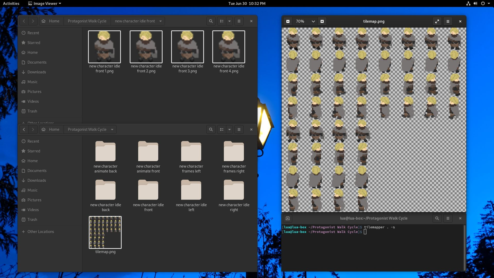

# Tilemapper v3
<i>Generate basic tilemaps from multiple images, or go beyond with automatic animation generation or directional tilemaps.</i>

Tilemapper recursively converts folders of images (tiles) into a tilemap using various different layout methods.



## Usage (CLI)
### Installation
The Tilemapper CLI requires Node.js and NPM be installed on the target computer. Atleast Node.js v12 is required.

Run these commands to install the latest version of Tilemapper:
```sh
# Normally:
$ npm install -g tilemapper
# With sudo:
$ sudo npm install -g --unsafe-perm tilemapper
```

Then invoke it:
```
$ tilemapper
Usage:
    tilemapper file/directory... [options]
Options:
    -h,-?,--help        Print this help message
    -V,--version        Print version information

    -v,--verbose        Output verbose logging information

    -e,--extensions     Comma-separated list of file extensions to match when
                        searching for input files, defaults to
                        "png,jpg,jpeg,gif,webp,tiff"

    -o,--output         Specify output file path. Defaults to "tilemap.png"
    -j,--output-json    Enable JSON information output and optionally provide a
                        file path to write the .json file to

    -t,--output-type    Specify output image data format, usually assumed from
                        output file extension. Valid values include: "png",
                        "jpg", "webp", and "tiff"

    -l,--l-list         Generate a tilemap layout in the simplest manner
                        possible, just put all input tiles in a continuous list
                        going from left to right, looping back to the next line
                        once "--l-list-length" is reached (default)
    -s,--l-sequence     Generate a tilemap layout that contains "sequences".
                        Each "sequence" is a continuous list of frames, usually
                        for an animation. Each folder in the inputted paths will
                        be treated as a new sequence
    -a,--l-animation    Advanced. Generate a tilemap layout that contains
                        "animations", where each animation has sub-sequences for
                        different angles. Please see online documentation for
                        more information about how this mode works

    -W,--width          Width of each tile in pixels. Defaults to 128
    -H,--height         Height of each tile in pixels. Defaults to 128

    -X,--min-x          Minimum count of tiles across the X axis
    -Y,--min-y          Minimum count of tiles across the Y axis

    -x,--l-list-length  Count of tiles across the X axis in the list layout
                        mode. Defaults to 16

    -L,--long-names     Use long tile/sequence/animation names? This will take
                        paths like "Art/Player/Walk_Forward/90/0.png" and output
                        "Art/Player/Walk_Forward" instead of just "Walk_Forward"

    -f,--fit            Fit mode to use when resizing tiles, if a tile needs to
                        be resized. Valid values include: "contain", "cover",
                        "fill", "inside", and "outside". Please see online
                        documentation for more information
    -k,--kernel         Kernel mode to use when resizing tiles, if a tile needs
                        to be resized. Valid values include: "nearest", "cubic",
                        "mitchell", "lancoz2", and "lancoz3". Please see online
                        documentation for more information

Version:
    tilemapper v3.0.0
```

### Options
#### `-h,-?,--help`
Outputs the help page.
#### `-V,--version`
Outputs the current Tilemapper version.
#### `-v,--verbose`
Enables verbose mode, which will output extra debug information and make log messages persistent instead of having messages overwrite eachother.
#### `-o,--output <file>`
Specify a file path to write the output data to. If this file has an extension and `-t,--output-type <type>` is not specified, the output data type will be inferred from the file's extension.
#### `-j,--output-json <file?>`
Output a JSON file to a containing sizing and layout information about this tilemap, for automatically interpreting the tilemap in supported programs (currently only used internally at Team Quay). When specified without a path argument, the file path is generated by taking the output image path and replacing the extension with `.json`.
#### `-t,--output-type <type>`
Explicitly specify the output image data format. Type can be one of:
 - `png`	Export a lossless Portable Network Graphics image.
 - `jpg`	Export a lossy JPEG image.
 - `webp`	Export a lossless WebP image.
 - `tiff`	Export a lossy Tagged Image File Format image.
#### `-l,--l-list`
The default layout mode. Generate a tilemap layout in the simplest manner possible, just put all input tiles in a continuous list going from left to right, looping back to the next line once `-x,--l-list-length` is reached.
#### `-s,--l-sequence`
Tilemapper v2's method of laying out tiles. Generate a tilemap layout that contains "sequences". Each "sequence" is a continuous list of frames, usually for an animation. Each folder in the inputted paths will be treated as a new sequence.
#### `-a,--l-animation`
For advanced users and users that want Tilemapper to handle animations with angles. Generate a tilemap layout that contains "animations", where each animation has sub-sequences for different angles.  
This will take a file structure like:
```
root/
	anim1/
		0/   [frame1.png, frame2.png, frame3.png]
		90/  [frame1.png, frame2.png, frame3.png]
		180/ [frame1.png, frame2.png, frame3.png]
		270/ [frame1.png, frame2.png, frame3.png]
	anim2/
		0/   [frame1.png, frame2.png, frame3.png]
		90/  [frame1.png, frame2.png, frame3.png]
		180/ [frame1.png, frame2.png, frame3.png]
		270/ [frame1.png, frame2.png, frame3.png]
```
And generate a JSON `layout` like:
```json
{ "animations": [{
	"name": "anim1",
	"angles": [
		{ ... },
		{ ... },
		{ ... },
		{ ... }
	]
},{
	"name": "anim2",
	"angles": [
		{ ... },
		{ ... },
		{ ... },
		{ ... }
	]
}] }
```
#### `-W,--width <px>`
Set the width (in pixels) of each tile in the tilemap. This defaults to `128` if not set.
#### `-H,--height <px>`
Set the height (in pixels) of each tile in the tilemap. This defaults to `128` if not set.
#### `-X,--min-x <count>`
If the tool you are using expects an appropriately sized tilemap, this option can be used to adjust the *minimum* count of tiles on the X axis. If not set, it has no effect, but when set to a value higher that 0 it will force the compositor to generate a tilemap atleast `count` tiles across.
#### `-Y,--min-y <count>`
If the tool you are using expects an appropriately sized tilemap, this option can be used to adjust the *minimum* count of tiles on the Y axis. If not set, it has no effect, but when set to a value higher that 0 it will force the compositor to generate a tilemap atleast `count` tiles from top to bottom.
#### `-x,--l-list-length <count>`
When using the list layout mode (`-l,--l-list`), this option sets how wide (number of tiles across) the output tilemap will be. It acts kind of like `-X,--min-x <count>`. If not set, it defaults to `16`.
#### `-L,--long-names`
Use long path names in outputted JSON information. By default, `name`s in the JSON object will be either the filename without extension or the top-level directory name. This option will force them to use full paths, relative to the working directory. This will take paths like "Art/Player/Walk_Forward/90/0.png" and output "Art/Player/Walk_Forward" instead of just "Walk_Forward".
#### `-f,--fit <fit>`
If an input image's size does not match the size of a tile, it will be resized. This option sets the fit mode to be used when resizing images. Fit can be one of:
 - `contain`	Preserving aspect ratio, ensure the image covers both provided dimensions by cropping/clipping to fit.
 - `cover`	Preserving aspect ratio, contain within both provided dimensions using "letterboxing" where necessary.
 - `fill`	Ignore the aspect ratio of the input and stretch to both provided dimensions.
 - `inside`	Preserving aspect ratio, resize the image to be as large as possible while ensuring its dimensions are less than or equal to both those specified.
 - `outside`	Preserving aspect ratio, resize the image to be as small as possible while ensuring its dimensions are greater than or equal to both those specified.
#### `-k,--kernel <kernel>`
If an input image's size does not match the size of a tile, it will be resized. This option configures the algorithm used when resizing images. Kernel can be one of:
 - `nearest`	Nearest neighbor algorithm.
 - `cubic`	Bicubic algorithm.
 - `mitchell`	Mitchell algorithm.
 - `lancoz2`	Lanczos resampling algorithm 2.
 - `lancoz3`	Lanczos resampling algorithm 3.

## Usage (API)
#### The `tilemap` function
On a compatible version of Node.js/NPM (v12 recommended), Tilemapper can be installed from the `tilemapper` package on NPM:
```sh
npm install tilemapper
```
Then, Tilemapper's API can be used in your JavaScript code:
```javascript
// Import the Tilemapper function
const { tilemap } = require("tilemapper");

// Call it with our options
const { data, info, layout } = await tilemap({
	paths: "playerframes/",
	layoutMode: "sequence",
	outputType: "png"
});

// TODO: Write `data` to a .png file....
```
Note that the `tilemap` function takes a single argument, `options`, that is used to influence the way it generates a tilemap, and returns a `Promise` with the output data.
```typescript
async function tilemap(options?: TilemapperOptions<...>): Promise<TilemapperOutput<...>>
```
Please see [src/index.ts](./src/index.ts) for more information on the types and options that can be passed to the API.
#### Reference for the `tilemap` options object
These are all the properties that the `tilemap` function will look for in its `options` object.
```typescript
/**
 * Paths to search for images.
 * Required.
 */
paths?: string | string[];
/**
 * Supported image extensions.
 * Default value: `["png", "jpg", "jpeg", "gif", "webp", "tiff", "svg"]`
 */
extensions?: string[];
/**
 * Working directory (used when generating dirnames).
 * Default value: `process.cwd()`
 */
workingDirectory?: string;

/**
 * Layout mode to use.
 * Required.
 */
layoutMode?: LayoutMode.ListLayout | LayoutMode.SequenceLayout | LayoutMode.AnimationLayout;
// NOTE: See src/index.ts for more info

/**
 * Output file data type.
 * Required.
 */
outputType?: OutputType;
// NOTE: See src/compositor.ts for more info
/**
 * Fit mode to use when resizing tiles, if a tile needs to be resized.
 * Default value: `ResizeFit.Cover`
 */
resizeFit?: ResizeFit;
// NOTE: See src/compositor.ts for more info
/**
 * Kernel to use when resizing tiles, if a tile needs to be resized.
 * Default value: `ResizeKernel.Nearest`
 */
resizeKernel?: ResizeKernel;
// NOTE: See src/compositor.ts for more info

/**
 * Width of each tile in pixels.
 * Default value: `128`
 */
tileWidth?: number;
/**
 * Height of each tile in pixels.
 * Default value: `128`
 */
tileHeight?: number;
/**
 * Minimum count of tiles across the X axis.
 * Default value: `0`
 */
minCountX?: number;
/**
 * Minimum count of tiles across the Y axis.
 * Default value: `0`
 */
minCountY?: number;

/**
 * Use full directory names in tile names (layout.tiles).
 * Default value: `false`
 */
longTileNames?: boolean;
/**
 * Width (in tiles) of the tilemap to generate.
 * Default value: `0`
 */
width?: number;
/**
 * Use full directory names in sequence names (layout.sequences[i]).
 * Default value: `false`
 */
longSequenceNames?: boolean;
/**
 * Use full directory names in animation names (layout.animations[i]).
 * Default value: `false`
 */
longAnimationNames?: boolean;

/**
 * Log handler configuration.
 * Used to specify callback functions for logging output.
 * Default value: `undefined`
 */
logHandlers?: LogHandlerConfig;
// NOTE: See src/log.ts for more info
```

## Authors
Made with ❤ by Lua MacDougall ([lua.wtf](https://lua.wtf/))

## License
This project is licensed under [MIT](LICENSE).
More info in the [LICENSE](LICENSE) file.

<i>"A short, permissive software license. Basically, you can do whatever you want as long as you include the original copyright and license notice in any copy of the software/source.  There are many variations of this license in use."</i> - [tl;drLegal](https://tldrlegal.com/license/mit-license)
