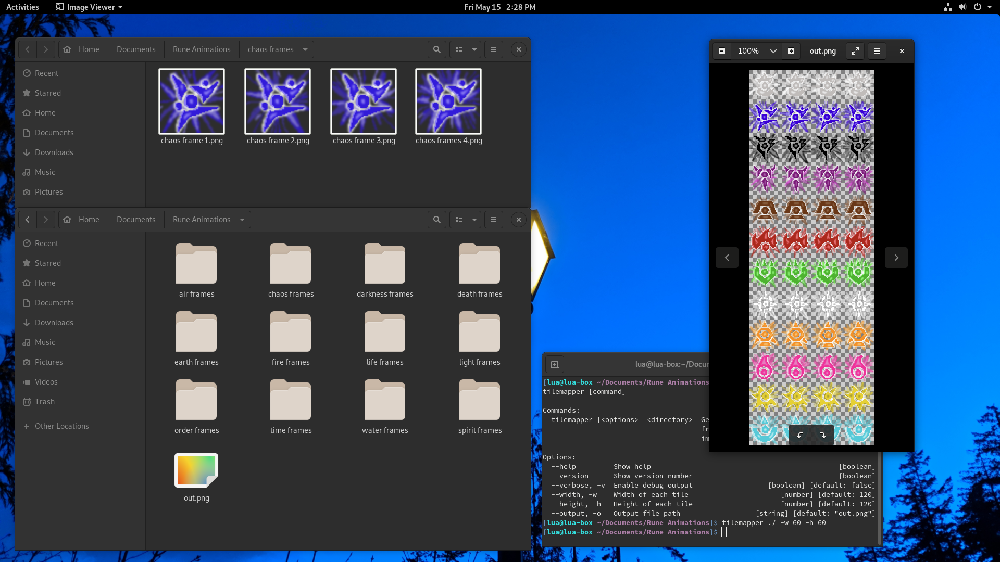

# Tilemapper
*Generate a tilemap from folders containing frames of animation or just multiple images.*

Tilemapper recursively converts folders of images (tiles) into a tilemap.

So, for example, using the directory `root/`:
```
root/
	anim1/
		1.png
		2.png
		3.png
		4.png
		subanim1/
			a.png
			b.png
			c.png
			d.png
	anim2/
		frame1.jpg
		frame2.jpg
		frame3final.jpg
		frame4.jpg
```
It will produce a 4x3 tilemap like this:
```
[ anim1's frames ]
[    subanim1    ]
[     anim2      ]
```

## Screenshots


## Installation
Requires any semi-recent version of [Node.js](https://nodejs.org/) (which comes with NPM).
```sh
npm install -g tilemapper
```

## Usage
Invoke Tilemapper with the `tilemapper` command.
```
  tilemapper [<options>] <directory>  Generate a tilemap from folders containing
                                      frames of animation or just multiple
                                      images

Options:
  --help         Show help                                             [boolean]
  --version      Show version number                                   [boolean]
  --verbose, -v  Enable debug output                  [boolean] [default: false]
  --width, -w    Width of each tile                      [number] [default: 120]
  --height, -h   Height of each tile                     [number] [default: 120]
  --output, -o   Output file path                  [string] [default: "out.png"]
```

## Authors
Made with ❤ by Jack MacDougall ([lua.wtf](https://lua.wtf/))

## License
This project is licensed under [MIT](LICENSE).
More info in the [LICENSE](LICENSE) file.

*"A short, permissive software license. Basically, you can do whatever you want as long as you include the original copyright and license notice in any copy of the software/source.  There are many variations of this license in use."* - [tl;drLegal](https://tldrlegal.com/license/mit-license)
